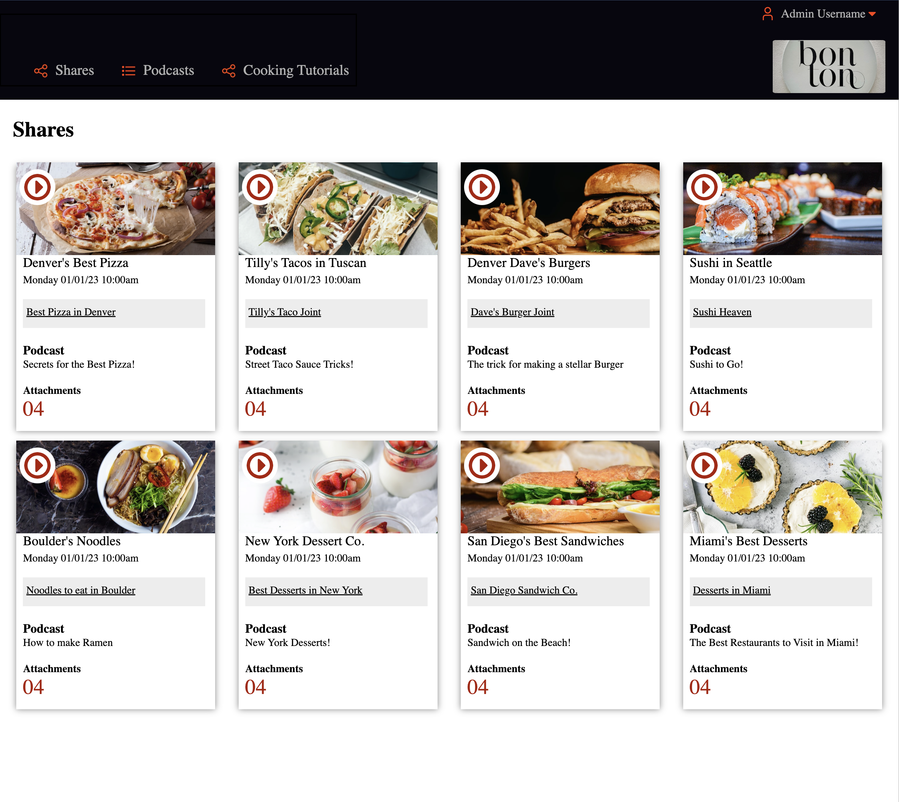
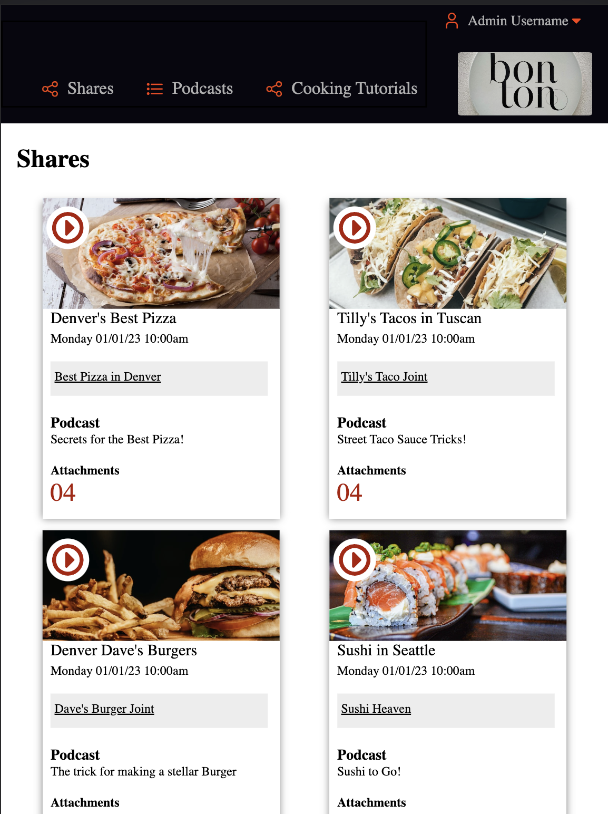
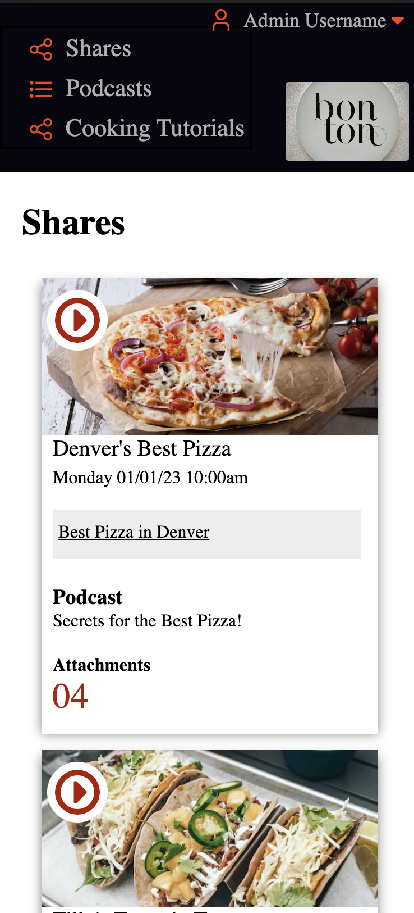

# Static Comp - Bon Ton Restaurant Reviews

## Abstract
In this solo project I created a static comp utilizing flexbox and responsive design with media queries.  This was a challenge in [Turing School of Software and Design](https://turing.edu/). 

## Site Link

[Link to site](https://bethwprojects.github.io/static_comp/)

## Technologies Used
 

   
   
 

 
## Wins
- Flexbox 
- Media Queries

## Future Extensions
- I plan to add more styling and update the media queries for a more inclusive design for all breakpoints.  

## Contributors
- Beth Wilson [LinkedIn](https://www.linkedin.com/in/beth-wilson-92594284/) [GitHub](https://github.com/BethWProjects)

